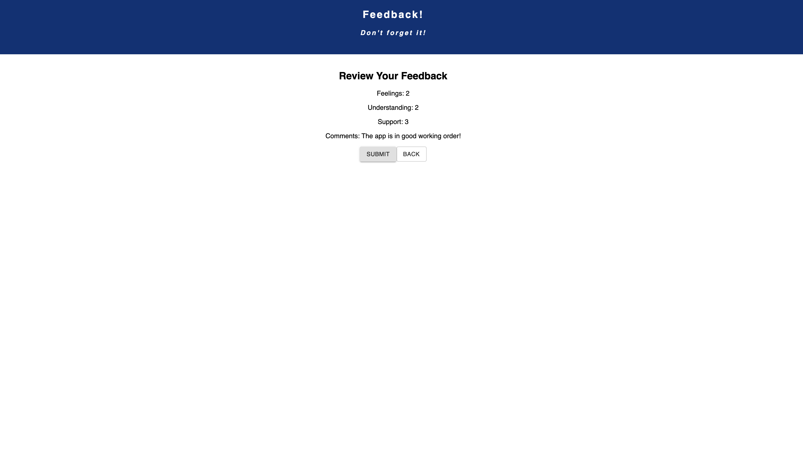

# Redux Feedback Loop

[Project Instructions](./INSTRUCTIONS.md), this line may be removed once you have updated the README.md

## Description 

This application takes feedback from the user on their lesson experiences for the day and records them on a SQL database. The user inputs 3 responses restricted to values between 0 and 5 and then can leave commetns on a fourht page. The user can also navigate back to previous questions if they decide to tchange their answers. The user is shown there results when they are finished for review and then they may submit their responses. When this happens, the application starts over with empty values. The application also has an admin page that allows the administrator to review all of the data stored in the database, including the ability to delete entries if they deisre to do so.  

The applicaiton uses redux to store the values the user enters while they are navigating between questions. The questions themselves are rendered with react using Routes and when the submissions are confirmed, the data in the redux store is sent to the postGreSQL database.  

## Screen Shots

## Installation

### Prerequisites:

- Node
- React
- Redux
- Postgres
- Material-ui
- Material-ui icons pack

### Install instructions:

1. From the command line, navigate the root directory
2. Run 'npm install'
3. Run 'npm install redux react-redux'
4. Run 'npm install redux logger'
5. Run 'npm install @matrial-ui/core'
6. Run 'npm install @material-ui/icons'
7. Create a postGreSQL database using the instructions in the data.sql file

## Built With

- HTML
- CSS
- Javascript
- Node
- Express
- PostGreSQL
- React
- Redux
- Material-UI

## License

[MIT]()

## Acknowledgment

Thanks to [Prime Digital Academy](www.primeacademy.io) who equipped and helped me to make this application a reality. 

Special thanks to my learnign group for this week from my Vatti Cohort:

- [Brady Baker](bradybaker)
- [Brady Johnson](BPJ94487)
- [Paul Kastenbauer](kastenbauer27)

Extra weekend study time thanks to the following;  
- [Josie Fredericksen](https://github.com/freder48)
- [Kimberly Orchard](https://github.com/korchard)

And last but never least, my Prime primary instructor:
- [Mary Mosman](https://github.com/mbMosman)